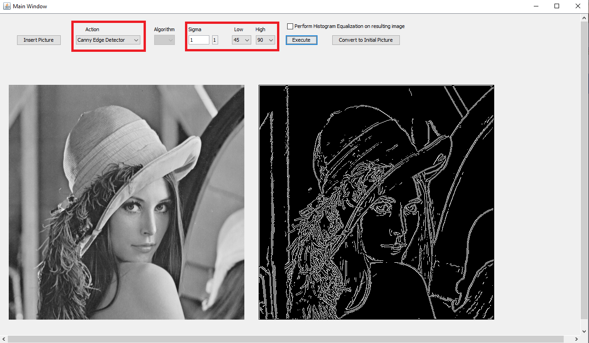
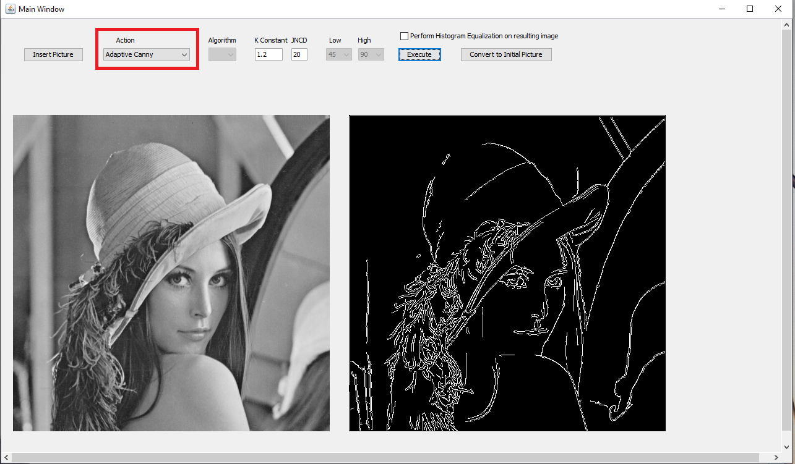

# AdaptiveCannyEdge
Adaptive Canny Edge Detector implementation. Traditional Edge Detector is also implemented.

Adaptive Canny Edge Detection is a novel method to detect edges of images, as opposed to traditional edge detection. Adaptive Canny Edge is a modification of traditional Canny Edge, which is an edge detection algorithm that uses a multi-stage algorithm to detect a wide range of edges in images. Adaptive adds a threshold that adapts to the given picture, depending on the color scale.

# How to execute the Java JAR file
Type into a terminal
```
java -jar AdaptiveCannyEdge.jar
```

# How to compile
1. Type this into a terminal
```
javac -d bin ./src/imgpro/*.java ./src/imgpro/adaptivecanny/*.java ./src/imgpro/gaussianblur/*.java ./src/imgpro/histogram/*.java ./src/imgpro/spatialfiltering/*.java 
```

# How to run a compiled file
1. If you compiled, change into the bin folder, then type this into a terminal
```
java imgpro.MainWindow
```

# Screenshots
**Just the Gaussian blur.**


**Regular Canny Edge Detection**


**Adaptive Canny Blurring**


**Adaptive Canny Edge Detection**

